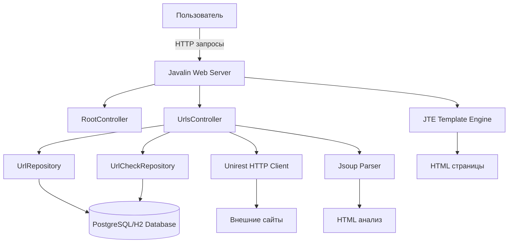

# Page Analyzer

### Hexlet tests and linter status:
[](https://github.com/valentin-osadchii/java-project-72/actions)
[](https://sonarcloud.io/summary/new_code?id=valentin-osadchii_java-project-72)
[](https://sonarcloud.io/summary/new_code?id=valentin-osadchii_java-project-72)

---

## Описание проекта

**[Анализатор страниц](https://java-project-72-production-0557.up.railway.app/)** - это полнофункциональное веб-приложение на базе фреймворка Javalin, которое позволяет:
- Добавлять URL-адреса сайтов для мониторинга
- Проверять доступность сайтов (HTTP статус-коды)
- Анализировать SEO-метрики (title, h1, description)
- Хранить историю проверок для каждого URL

---

## Архитектура проекта

### Структура приложения

```
app/
├── src/main/java/hexlet/code/
│   ├── App.java                    # Точка входа, конфигурация приложения
│   ├── controller/                 # Контроллеры (обработка HTTP-запросов)
│   │   ├── RootController.java     # Главная страница
│   │   └── UrlsController.java     # CRUD операции с URL
│   ├── dto/                        # Data Transfer Objects
│   │   ├── BasePage.java           # Базовый класс для страниц
│   │   ├── RootPage.java           # DTO главной страницы
│   │   └── urls/                   # DTO для работы с URL
│   ├── model/                      # Модели данных
│   │   ├── Url.java                # Модель URL
│   │   └── UrlCheck.java           # Модель проверки URL
│   ├── repository/                 # Слой доступа к данным
│   │   ├── BaseRepository.java     # Базовый репозиторий
│   │   ├── UrlRepository.java      # Репозиторий URL
│   │   └── UrlCheckRepository.java # Репозиторий проверок
│   └── util/                       # Утилиты
│       ├── DateUtils.java          # Работа с датами
│       └── NamedRoutes.java        # Маршруты приложения
├── src/main/resources/
│   ├── schema.sql                  # SQL-схема базы данных
│   └── templates/                  # JTE-шаблоны (HTML)
└── src/test/                       # Тесты
```

### Диаграмма компонентов



---

## Технологический стек

### Backend
- **Java 21** - язык программирования
- **Javalin 6.1.3** - легковесный веб-фреймворк
- **Gradle** - система сборки проекта

### База данных
- **PostgreSQL** - production база данных
- **H2** - in-memory база для разработки и тестов
- **HikariCP** - пул соединений с БД

### Шаблонизация
- **JTE (Java Template Engine)** - современный шаблонизатор

### HTTP & Парсинг
- **Unirest** - HTTP-клиент для проверки сайтов
- **Jsoup** - парсинг HTML и извлечение SEO-данных

### Качество кода
- **Checkstyle** - проверка стиля кода
- **JaCoCo** - покрытие кода тестами
- **SonarQube** - статический анализ кода

### Тестирование
- **JUnit 5** - фреймворк для тестирования
- **AssertJ** - fluent assertions
- **MockWebServer** - мокирование HTTP-серверов

### Утилиты
- **Lombok** - уменьшение boilerplate кода
- **SLF4J** - логирование

---

## Модель данных

### Таблица `urls`
```sql
id          BIGINT PRIMARY KEY
name        VARCHAR(255) NOT NULL    -- Нормализованный URL
created_at  TIMESTAMP NOT NULL       -- Дата добавления
```

### Таблица `url_checks`
```sql
id           BIGINT PRIMARY KEY
url_id       BIGINT NOT NULL         -- FK на urls
status_code  INT                     -- HTTP статус-код
h1           VARCHAR(255)            -- Заголовок H1
title        VARCHAR(255)            -- Title страницы
description  TEXT                    -- Meta description
created_at   TIMESTAMP NOT NULL      -- Дата проверки
```

---

## Функциональность

### Основные возможности

1. **Добавление URL**
   - Валидация и нормализация URL
   - Проверка на дубликаты
   - Сохранение в базу данных

2. **Просмотр списка URL**
   - Отображение всех добавленных URL
   - Показ последней проверки для каждого URL

3. **Детальная информация об URL**
   - История всех проверок
   - SEO-метрики

4. **Проверка URL**
   - HTTP-запрос к сайту
   - Извлечение title, h1, description
   - Сохранение результатов проверки

---

## Конфигурация

### Переменные окружения

- `PORT` - порт приложения (по умолчанию: 7070)
- `JDBC_DATABASE_URL` - URL подключения к БД (по умолчанию: H2 in-memory)

### Пример для PostgreSQL
```bash
export JDBC_DATABASE_URL=jdbc:postgresql://localhost:5432/page_analyzer
export PORT=8080
```

---

## Сборка и запуск

### Локальный запуск
```bash
cd app
./gradlew run
```

### Сборка JAR
```bash
cd app
./gradlew build
```

### Docker
```bash
docker build -t page-analyzer .
docker run -p 7070:7070 page-analyzer
```

### Тестирование
```bash
cd app
./gradlew test
```

---

## Паттерны и практики

- **MVC архитектура** - разделение на контроллеры, модели и представления
- **Repository pattern** - абстракция доступа к данным
- **DTO pattern** - передача данных между слоями
- **Dependency Injection** - через статические поля (упрощенный вариант)
- **Template Method** - базовый репозиторий
- **Нормализация URL** - приведение к единому формату (protocol://host:port)

---

## CI/CD и качество кода

Проект интегрирован с:
- **GitHub Actions** - автоматическая проверка кода
- **SonarCloud** - анализ качества и покрытия кода
- **Checkstyle** - соблюдение code style

---

Это учебный проект, разработанный в рамках курса [Hexlet](https://hexlet.io) "Java-разработчик".